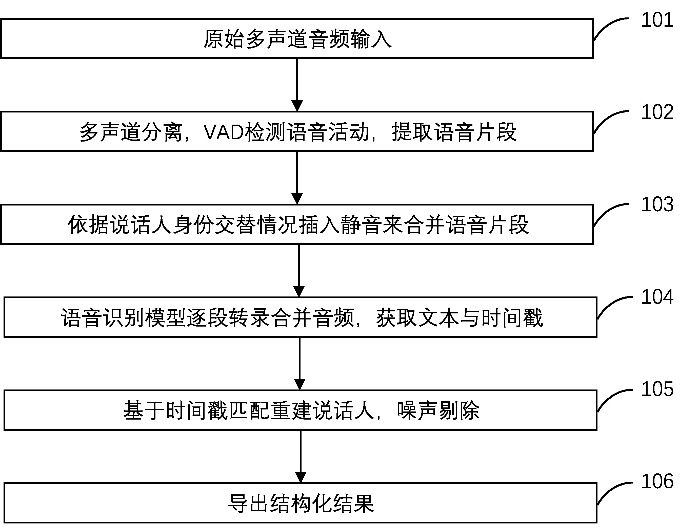
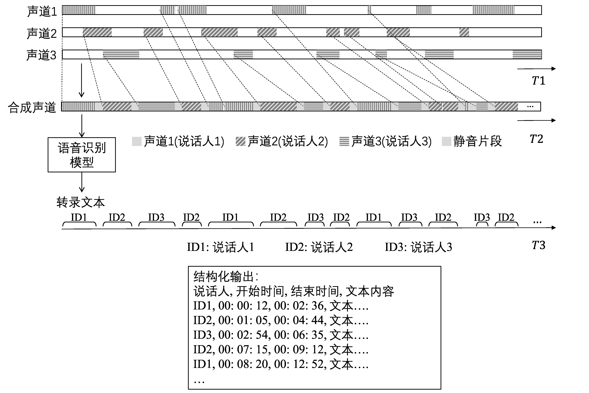

# Multichannel ASR

**[English](README.md) | [简体中文](README_zh-CN.md)**

---

## 项目概述

Multichannel ASR 是一个免训练的多声道音频转录解决方案,适用于呼叫中心录音、远程会议等场景。它使用标准的单声道ASR模型(如OpenAI Whisper),通过创新的VAD声道合并和静音插入策略实现精确的说话人分离。

## 主要特性

- **免训练**: 无需模型训练或微调
- **模型无关**: 适用于任何单声道ASR模型(Whisper、FunASR、SenseVoice等)
- **高效处理**: 支持多进程批量处理

## 工作原理

该流程通过六个步骤将多声道音频转换为带说话人标签的转录稿:

<div align="center">
  
</div>

1. **多声道输入**: 加载立体声或多声道音频
2. **VAD与分割**: 分别检测各声道的语音活动
3. **静音插入与合并**: 使用策略性静音间隔合并声道:
   - 不同说话人之间插入1000ms静音
   - 同一说话人内部插入50ms静音
4. **ASR转录**: 使用Whisper转录合并后的音频
5. **基于时间戳的说话人分离**: 将转录时间戳匹配到原始说话人
6. **结构化输出**: 生成包含说话人标签和时间戳的Excel文件

<div align="center">
  
</div>

## 安装

### 先决条件

- Python 3.10+
- CUDA 12.2+ (GPU加速)
- FFmpeg: `sudo apt-get install ffmpeg` (Ubuntu) 或 `brew install ffmpeg` (macOS)

### 安装依赖

```bash
# 克隆仓库
git clone https://github.com/Deng-GuiFeng/multichannel-asr.git
cd multichannel-asr

# 安装支持CUDA的PyTorch (CUDA 12.6兼容CUDA 12.2)
pip3 install torch torchvision --index-url https://download.pytorch.org/whl/cu126

# 安装其他依赖
pip install -r requirements.txt
```

## 使用方法

```bash
python src/main.py \
    --model_id openai/whisper-large-v3-turbo \
    --device cuda:0 \
    --src_dir ./data/input \
    --tgt_dir ./data/output
```

**参数说明:**
- `--model_id`: Hugging Face模型ID (如 `openai/whisper-large-v3-turbo`)
- `--device`: 使用的设备 (`cuda:0` 表示GPU, `cpu` 表示CPU)
- `--src_dir`: 包含音频文件的输入目录
- `--tgt_dir`: 转录结果的输出目录

## 专利声明

本项目实现了中国专利 **CN120895028A**(已公开)中描述的方法。代码采用MIT许可证发布,但专利方法的商业使用可能需要单独授权。

## 许可证

MIT许可证 - 详见 [LICENSE.txt](LICENSE.txt)

## 致谢

- [OpenAI Whisper](https://github.com/openai/whisper)
- [Hugging Face Transformers](https://github.com/huggingface/transformers)
- [WebRTC VAD](https://github.com/wiseman/py-webrtcvad)
